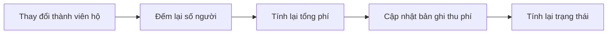

# Quy Tắc Nghiệp Vụ - Hệ Thống Quản Lý Dân Cư

> **Đồ án Công Nghệ Phần Mềm**  
> Phiên bản: 1.0  
> Cập nhật: Tháng 11/2024

---

## Mục Lục

1. [Tổng Quan](#1-tổng-quan)
2. [Quy Tắc Thu Phí](#2-quy-tắc-thu-phí)
3. [Quy Tắc Quản Lý Nhân Khẩu](#3-quy-tắc-quản-lý-nhân-khẩu)
4. [Quy Tắc Quản Lý Hộ Khẩu](#4-quy-tắc-quản-lý-hộ-khẩu)
5. [Quy Tắc Đợt Thu Phí](#5-quy-tắc-đợt-thu-phí)
6. [Quy Tắc Quản Lý Tài Khoản](#6-quy-tắc-quản-lý-tài-khoản)
7. [Quy Tắc Phân Quyền](#7-quy-tắc-phân-quyền)

---

## 1. Tổng Quan

Tài liệu này mô tả các quy tắc nghiệp vụ được áp dụng trong hệ thống Quản Lý Dân Cư. Các quy tắc này được thực thi tự động bởi backend để đảm bảo tính nhất quán và chính xác của dữ liệu.

### 1.1 Nguyên Tắc Chung

- **Validation tự động**: Mọi dữ liệu đầu vào đều được kiểm tra tính hợp lệ
- **Tính toán tự động**: Các giá trị như tổng phí, trạng thái thanh toán được tự động tính toán
- **Đồng bộ dữ liệu**: Hệ thống tự động duy trì tính nhất quán giữa các bảng liên quan
- **Audit trail**: Lưu vết người tạo, người cập nhật cho các thao tác quan trọng

---

## 2. Quy Tắc Thu Phí

### 2.1 Công Thức Tính Phí

**Công thức cơ bản:**

```
Tổng phí năm = Định mức × 12 tháng × Số người đủ điều kiện
```

**Giải thích:**
- **Định mức**: Mức phí hàng tháng cho mỗi người (VND/người/tháng), được thiết lập trong đợt thu phí
- **12 tháng**: Phí được tính theo năm
- **Số người đủ điều kiện**: Chỉ tính những người đang thường trú (không tạm vắng)

**Ví dụ:**
- Hộ khẩu HK001 có 4 thành viên thường trú
- Định mức phí: 6,000 VND/người/tháng
- Tổng phí năm = 6,000 × 12 × 4 = 288,000 VND

---

### 2.2 Quy Tắc Đếm Số Người

**Điều kiện đủ điều kiện:**

Người được tính vào phí phải đáp ứng:
- Là thành viên của hộ khẩu
- **KHÔNG** đang trong thời gian tạm vắng (tamVangDen >= ngày hiện tại)

**Ví dụ minh họa:**

| Thành viên | Trạng thái | Tính phí? | Lý do |
|------------|-----------|-----------|-------|
| Người A | Thường trú | ✓ | Đang sinh sống tại hộ |
| Người B | Tạm vắng đến 31/12/2024 | ✓ | Đã hết hạn tạm vắng |
| Người C | Tạm vắng đến 30/06/2026 | ✗ | Đang tạm vắng |
| Người D | Thường trú | ✓ | Đang sinh sống tại hộ |

Kết quả: 3 người được tính phí (A, B, D)

---

### 2.3 Validation Ngày Thu Phí

**Quy tắc:**

Ngày thu phí phải nằm trong khoảng thời gian của đợt thu phí:
- **Ngày thu ≥ Ngày bắt đầu đợt thu phí**
- **Ngày thu ≤ Ngày kết thúc đợt thu phí**

**Thông báo lỗi:**

1. Nếu ngày thu **trước** ngày bắt đầu:
   ```
   Đợt thu phí 'Phí quản lý tháng 1/2025' chưa bắt đầu. 
   Ngày thu phải từ 01/01/2025 trở đi.
   ```

2. Nếu ngày thu **sau** ngày kết thúc:
   ```
   Đợt thu phí 'Phí quản lý tháng 1/2025' đã kết thúc vào 31/01/2025. 
   Không thể ghi nhận thanh toán sau ngày này.
   ```

---

### 2.4 Cơ Chế Thanh Toán Nhiều Lần

**Đặc điểm:**

- Hệ thống cho phép một hộ khẩu thanh toán nhiều lần cho cùng một đợt thu phí
- Tổng số tiền đã thu = tổng tất cả các lần thanh toán
- Trạng thái được cập nhật đồng bộ cho **tất cả** các bản ghi liên quan

**Ví dụ:**

```
Hộ khẩu: HK001
Đợt thu phí: Phí năm 2025
Tổng phí: 288,000 VND

Lần 1 (10/01/2025): Nộp 100,000 VND
   → Tổng đã thu: 100,000 VND
   → Trạng thái: CHUA_NOP (chưa đủ)

Lần 2 (20/01/2025): Nộp 188,000 VND
   → Tổng đã thu: 288,000 VND
   → Trạng thái: DA_NOP (đã đủ)
   → Cả 2 bản ghi đều được cập nhật thành DA_NOP

Lần 3 (25/01/2025): Nộp 50,000 VND (nộp thêm)
   → Tổng đã thu: 338,000 VND
   → Trạng thái: DA_NOP (vẫn giữ nguyên)
```

---

### 2.5 Xác Định Trạng Thái Thanh Toán

**Các trạng thái:**

| Trạng thái | Điều kiện | Áp dụng cho |
|------------|-----------|-------------|
| **CHUA_NOP** | Tổng đã thu < Tổng phí | Phí bắt buộc |
| **DA_NOP** | Tổng đã thu ≥ Tổng phí | Phí bắt buộc |
| **KHONG_AP_DUNG** | Luôn luôn | Phí tự nguyện |

**Lưu ý:** Trạng thái được tính dựa trên **tổng các lần thanh toán**, không phải từng lần riêng lẻ.

---

### 2.6 Tự Động Tính Lại Phí

**Kích hoạt khi:**

1. Thêm nhân khẩu mới vào hộ
2. Xóa nhân khẩu khỏi hộ
3. Thay đổi trạng thái tạm vắng của nhân khẩu

**Chỉ áp dụng cho:** Phí bắt buộc (BAT_BUOC)

**Quy trình:**



**Ví dụ:**

```
Trạng thái ban đầu:
- Hộ HK001: 4 người
- Tổng phí: 288,000 VND
- Đã nộp: 288,000 VND
- Trạng thái: DA_NOP

Sự kiện: Thêm 1 người mới
- Số người mới: 5
- Tổng phí mới: 360,000 VND
- Đã nộp: 288,000 VND (không thay đổi)
- Trạng thái mới: CHUA_NOP (thiếu 72,000 VND)
```

---

### 2.7 Tạo Bản Ghi Ban Đầu

**Quy tắc:**

Khi tạo hộ khẩu mới, hệ thống tự động:
1. Tìm đợt thu phí gần nhất
2. Tạo bản ghi thu phí với:
   - Số tiền đã thu = 0
   - Trạng thái = CHUA_NOP (cho phí bắt buộc) hoặc KHONG_AP_DUNG (cho phí tự nguyện)

---

## 3. Quy Tắc Quản Lý Nhân Khẩu

### 3.1 Validation Thông Tin Cơ Bản

**Trường bắt buộc:**
- Họ và tên
- Ngày sinh
- Giới tính (Nam, Nữ, Khác)
- Hộ khẩu (phải tồn tại)

**Quy tắc ngày sinh:**
- Phải là ngày trong quá khứ hoặc hiện tại
- Không được là ngày tương lai

---

### 3.2 Quy Tắc CMND/CCCD Theo Tuổi

**Công thức tính tuổi:**
```
Tuổi = Năm hiện tại - Năm sinh
```

**Quy tắc validation:**

| Tuổi | CMND/CCCD | Ngày cấp | Nơi cấp |
|------|-----------|----------|---------|
| < 14 | Không bắt buộc | Không bắt buộc | Không bắt buộc |
| ≥ 14 | **Bắt buộc** | **Bắt buộc** | **Bắt buộc** |

**Lý do:** Theo quy định pháp luật Việt Nam, công dân từ 14 tuổi trở lên phải có CMND/CCCD.

---

### 3.3 Quy Tắc Tạm Vắng

**Định nghĩa:**

Tạm vắng là trạng thái công dân vắng mặt khỏi nơi thường trú trong một khoảng thời gian.

**Validation:**
- Ngày bắt đầu < Ngày kết thúc
- Lý do tạm vắng (tùy chọn)

**Ảnh hưởng:**

Nếu ngày kết thúc tạm vắng ≥ ngày hiện tại:
- Công dân **KHÔNG** được tính vào phí hộ khẩu
- Phí được tự động tính lại cho tất cả đợt thu phí bắt buộc

---

### 3.4 Quy Tắc Tạm Trú

**Định nghĩa:**

Tạm trú là trạng thái công dân tạm trú tại địa phương trong thời gian ngắn.

**Validation:**
- Ngày bắt đầu < Ngày kết thúc
- Lý do tạm trú (tùy chọn)

**Lưu ý:** Khác với tạm vắng, tạm trú **KHÔNG** ảnh hưởng đến tính phí.

---

### 3.5 Quy Tắc Khai Tử

**Quy trình:**
- Ngày khai tử được ghi nhận tự động = ngày hiện tại
- Lý do khai tử (tùy chọn)

**Lưu ý:** 
- Dữ liệu người đã mất vẫn được lưu trữ để tra cứu lịch sử
- Frontend nên lọc không hiển thị trong danh sách hoạt động

---

## 4. Quy Tắc Quản Lý Hộ Khẩu

### 4.1 Validation Thông Tin Hộ Khẩu

**Trường bắt buộc:**
- Số hộ khẩu (duy nhất trong hệ thống)
- Tên chủ hộ
- Địa chỉ thường trú

**Tự động cập nhật:**
- Số lượng thành viên = tổng số nhân khẩu trong hộ

---

### 4.2 Quy Tắc Xóa Hộ Khẩu

**Cascade delete (xóa liên kết):**

Khi xóa hộ khẩu, hệ thống tự động xóa:
- Tất cả nhân khẩu trong hộ
- Tất cả bản ghi thu phí liên quan

**Lưu ý:** Thao tác này **KHÔNG THỂ** hoàn tác, cần cảnh báo người dùng.

---

## 5. Quy Tắc Đợt Thu Phí

### 5.1 Phân Loại Phí

**Hai loại phí:**

**1. Phí Bắt Buộc (BAT_BUOC):**
- Định mức phải > 0
- Tự động tạo bản ghi cho tất cả hộ khẩu
- Trạng thái: CHUA_NOP hoặc DA_NOP
- Tự động tính lại khi số lượng thành viên hộ thay đổi

**2. Phí Tự Nguyện (TU_NGUYEN):**
- Định mức mặc định = 0
- Không tự động tạo bản ghi
- Trạng thái: luôn là KHONG_AP_DUNG
- Không tự động tính lại

---

### 5.2 Validation Thời Gian

**Quy tắc:**
- Ngày kết thúc ≥ Ngày bắt đầu
- Không được trùng lặp thời gian với đợt khác (tùy chọn)

---

### 5.3 Validation Định Mức

| Loại phí | Định mức | Yêu cầu |
|----------|----------|---------|
| BAT_BUOC | Phải > 0 | Bắt buộc |
| TU_NGUYEN | Có thể = 0 | Không bắt buộc |

---

## 6. Quy Tắc Quản Lý Tài Khoản

### 6.1 Validation Đăng Ký

**Quy tắc:**
- Tên đăng nhập: tối thiểu 3 ký tự, duy nhất
- Mật khẩu: tối thiểu 6 ký tự, được mã hóa BCrypt
- Email: phải hợp lệ
- Vai trò: ADMIN, TOTRUONG, hoặc KETOAN

---

### 6.2 Quy Tắc Xóa Tài Khoản

**Hạn chế:**
1. **Không được** xóa tài khoản ADMIN
2. **Không được** xóa tài khoản của chính mình

**Lý do:** Đảm bảo luôn có ít nhất một ADMIN trong hệ thống và tránh tự khóa mình ra khỏi hệ thống.

---

### 6.3 Thời Hạn Token

**Quy tắc:**
- JWT token có hiệu lực: 24 giờ
- Sau khi hết hạn, người dùng phải đăng nhập lại
- Token không thể gia hạn, chỉ có thể tạo mới

---

## 7. Quy Tắc Phân Quyền

### 7.1 Ma Trận Phân Quyền Chi Tiết

| Chức năng | ADMIN | TOTRUONG | KETOAN | Mô tả |
|-----------|-------|----------|---------|-------|
| **Quản lý nhân khẩu** |
| Xem danh sách | ✓ | ✓ | ✓ | Tất cả vai trò |
| Thêm mới | ✓ | ✓ | ✗ | Chỉ quản lý |
| Cập nhật | ✓ | ✓ | ✗ | Chỉ quản lý |
| Xóa | ✓ | ✓ | ✗ | Chỉ quản lý |
| Tạm trú/Tạm vắng | ✓ | ✓ | ✗ | Chỉ quản lý |
| Khai tử | ✓ | ✓ | ✗ | Chỉ quản lý |
| **Quản lý hộ khẩu** |
| Xem danh sách | ✓ | ✓ | ✓ | Tất cả vai trò |
| Thêm mới | ✓ | ✓ | ✗ | Chỉ quản lý |
| Cập nhật | ✓ | ✓ | ✗ | Chỉ quản lý |
| Xóa | ✓ | ✓ | ✗ | Chỉ quản lý |
| **Quản lý đợt thu phí** |
| Xem danh sách | ✓ | ✓ | ✓ | Tất cả vai trò |
| Tạo đợt mới | ✓ | ✓ | ✗ | Chỉ quản lý |
| Cập nhật | ✓ | ✓ | ✗ | Chỉ quản lý |
| Xóa | ✓ | ✓ | ✗ | Chỉ quản lý |
| **Thu phí hộ khẩu** |
| Xem danh sách | ✓ | ✓ | ✓ | Tất cả vai trò |
| Ghi nhận thanh toán | ✓ | ✗ | ✓ | Admin và kế toán |
| Cập nhật | ✓ | ✗ | ✓ | Admin và kế toán |
| Xóa | ✓ | ✗ | ✓ | Admin và kế toán |
| Tính phí | ✓ | ✓ | ✓ | Tất cả vai trò |
| **Quản lý tài khoản** |
| Xem danh sách | ✓ | ✗ | ✗ | Chỉ Admin |
| Xóa tài khoản | ✓ | ✗ | ✗ | Chỉ Admin |

---

### 7.2 Nguyên Tắc Phân Quyền

**ADMIN:**
- Toàn quyền trên hệ thống
- Quản lý tài khoản người dùng
- Thực hiện mọi thao tác

**TOTRUONG (Tổ trưởng):**
- Quản lý thông tin dân cư (nhân khẩu, hộ khẩu)
- Quản lý đợt thu phí
- Xem báo cáo thu phí
- **Không** được ghi nhận thanh toán

**KETOAN (Kế toán):**
- Xem thông tin dân cư (chỉ đọc)
- Xem đợt thu phí (chỉ đọc)
- Ghi nhận và quản lý thanh toán
- Xem báo cáo tài chính

---

## Kết Luận

Các quy tắc nghiệp vụ trong tài liệu này được thiết kế để:
- Đảm bảo tính chính xác của dữ liệu
- Tự động hóa các quy trình phức tạp
- Ngăn chặn lỗi do người dùng
- Duy trì tính nhất quán của hệ thống

Tất cả các quy tắc đều được thực thi tự động ở tầng backend, đảm bảo tính toàn vẹn dữ liệu ngay cả khi có nhiều người dùng thao tác đồng thời.

**Lưu ý quan trọng:**
- Mọi thay đổi về quy tắc nghiệp vụ cần được cập nhật đồng bộ trong code và tài liệu
- Cần test kỹ lưỡng các tính năng tự động tính toán và validation
- Phân quyền phải được kiểm tra ở cả frontend và backend

---

**Hết tài liệu Quy Tắc Nghiệp Vụ**
